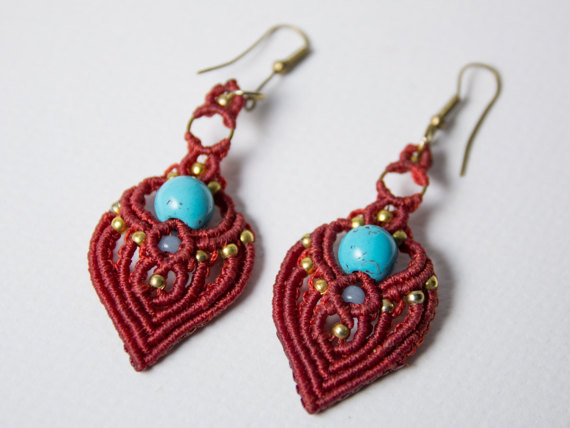

<!DOCTYPE html>
<html lang="en">

<head>
<title>The Zingas Project Page 01</title>
<meta charset="utf-8">
  <meta name="viewport" content="width=device-width, initial-scale=1">
  <link rel="stylesheet" href="https://maxcdn.bootstrapcdn.com/bootstrap/4.5.2/css/bootstrap.min.css">
  
  
  

<link rel="stylesheet" href="Head.css">

<link rel="stylesheet" href="https://fonts.googleapis.com/css?family=Sofia">
<link href="https://fonts.googleapis.com/css2?family=Dancing+Script&family=Indie+Flower&display=swap" rel="stylesheet">

</head>

<body>

<header>

 

  <ul class="nav justify-content-center">
    <li class="nav-item"><a href="index.md">JEWELLERY</a></li>
    <li class="nav-item"><a href="ZingasSecondPage.html">COLLECTIONS</a></li>
    <li class="nav-item"><a href="ZingasThirdPage.html">OUR STORY</a></li>
  </ul>
 

 

 

   <ul class="nav justify-content-center">
     <li class="nav-item"><i id="ii" class="fab fa-facebook-f"></i></li>
     <li class="nav-item"><i id="ii" class="fab fa-instagram-square"></i></li>
     <li class="nav-item"><i id="ii" class="fab fa-etsy"></i></li>
   </ul>
 

</header>

<!--
-->

  <!-- Indicators -->
  <ul class="carousel-indicators">
    <li data-target="#demo" data-slide-to="0" class="active"></li>
    <li data-target="#demo" data-slide-to="1"></li>
    <li data-target="#demo" data-slide-to="2"></li>
  </ul>

  <!-- The slideshow -->
  

    

      

             

               
             

             

               
             

             

               
             

      

    

    

      

             

               
             

             

               
             

             

               
             

      

    

    

      

             

               
             

             

               
             

             

               
             

      

    

  

  <!-- Left and right controls-->
  <a class="carousel-control-prev" href="#demo" data-slide="prev">
    
  </a>
  <a class="carousel-control-next" href="#demo" data-slide="next">
    
  </a>

<article>

  

    

    

    

After placing this code in our CSS file,
      we can apply the "tab" class to any text to create
      the appearance of a tab. The value of the margin-left
      can be increased or decreased depending on your needs.

    

  

  

  

    

After placing this code in our CSS file,
      we can apply the "tab" class to any text to create
      the appearance of a tab. The value of the margin-left
      can be increased or decreased depending on your needs.

    

    

    

  

  

  

    

    

    

After placing this code in our CSS file,
      we can apply the "tab" class to any text to create
      the appearance of a tab. The value of the margin-left
      can be increased or decreased depending on your needs.

    

  

  

  

    

After placing this code in our CSS file,
      we can apply the "tab" class to any text to create
      the appearance of a tab. The value of the margin-left
      can be increased or decreased depending on your needs.

    

    

    

  

</article>

<footer id="foot">

  

    
<h1 style="color:white;">About the project.</h1>
The Zingas Project is a unique macrame line
       of the handmade jewellery created by Athanasia Vlasopoulou,
       a passionate Greek designer.

    

    

      <ul class="list-group list-group-flush justify-content-center">
        <li style="list-style-type: none; padding-left:120px;" class="nav-item"><i id="phone"class="fas fa-map-marker-alt"></i>
 The Zingas addres.
</li>
         
        <li style="list-style-type: none; padding-left:120px;" class="nav-item"><i id="phone" class="far fa-envelope"></i>
The Zingas mail.
</li>
         
        <li style="list-style-type: none; padding-left:120px;" class="nav-item"><i id="phone" class="fas fa-phone-square"></i>
+0300000000.
</li>
      </ul>
    

  

</footer>

</body>
</html>
